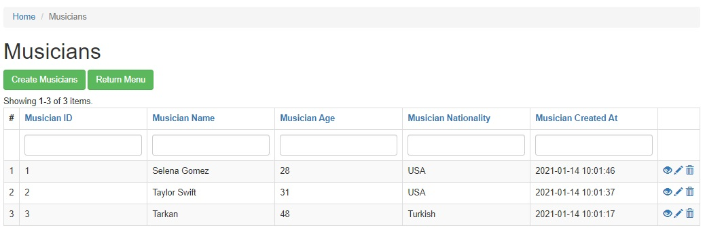
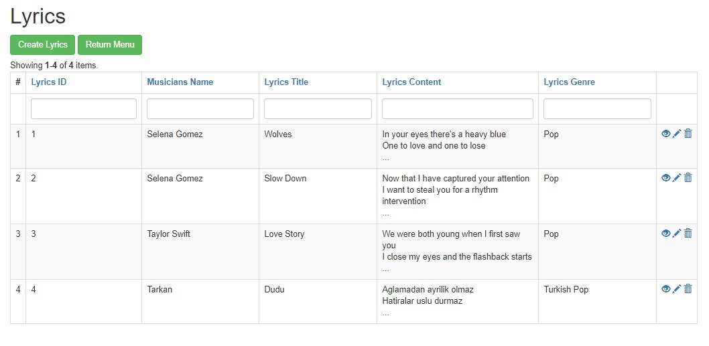

# Yii2 Şarkı Sözü Modülü
yii2-lyrics

# Nasıl Kurulur?

Modülü mevcut yii projenize packegist üstünden aşağıdaki composer komutu ile kurabilirsiniz.

```
composer require --prefer-dist ozgepoyraz/yii2-lyrics "dev-master"
 ```

Daha sonrasında advanced yii projesi için backend\config\main.php dosyasında modules kısmına aşağıdaki gibi modülü eklemeniz gerekmektedir.

```
'modules' => [
       ...
     'lyrics' => [
            'class' => 'ozgepoyraz\lyrics\Module',
        ],

   ],
 ```

Daha sonrasında migration işlemi gerçekleştirerek modül için gerekli tabloları oluşturmanız gerekiyor. Bunun için yii üzerinden bir konsol komutu girmelisiniz aşağıdaki komutu girerek migration işlemini gerçekleştirebilirsiniz.(Komutu proje dizininde giriniz.)

```
  php yii migrate/up --migrationPath=@vendor/ozgepoyraz/yii2-lyrics/src/migrations
 ```

Artık modül başarıyla kurulmuştur.

"domaininiz/backend/web/index.php?r=lyrics" adresinden modül sayfasına ulaşabilirsiniz.


# Modül Hakkında

Modül anasayfasına girdiğinizde karşınıza aşağıdaki gibi bir sayfa gelecektir.


"Manage Musicians" Butonu ile Müzisyenler tablosu üzerinde işlemlerinizi gerçekleştirebilirsiniz.

Müzisyenler sayfasında "Create Musician" ile form üzerinde isim, yaş ve milliyet girerek yeni müzisyen ekleyebilirsiniz. Ayrıca eklenen her veri için sistem saatinden otomatik olarak oluşturulma zamanı değeri de doldurulur. Örnek Müzisyenler tablosu;



Daha sonrasında "domaininiz/backend/web/index.php?r=lyrics" route'u ile modül anasayfasına dönerek "Manage Lyrics" butonu ile Şarkı Sözleri tablosu üzerinde işlemlerinizi gerçekleştirebilirsiniz ya da direkt olarak bu sayfaya "domaininiz/backend/web/index.php?r=lyrics/lyrics" route'u ile ulaşabilirsiniz. Burada "Create Lyrics" ile yeni bir şarkı sözü oluşturmak istediğinizde;


İlgili şarkı sözünü daha önce oluşturduğunuz bir sanatçı ile ilişkilendirmeniz gerekmektedir. Eğer herhangi bir sanatçı ile ilişkilendirmek istemiyorsanız. Anonim adı ile bir müzisyen oluşturup, kimliği belirsiz şarkı sözlerini ilişkiledirmeniz gerekmektedir. Daha sonrasında şarkı sözü için başlık, içerik ve tür kısımlarını doldurarak şarkı sözleri oluşturabilirsiniz.Aşağıda örnek olarak oluşturulmuş ve müzisyenlerle ilişkilendirilmiş şarkı sözleri bulunmaktadır.




